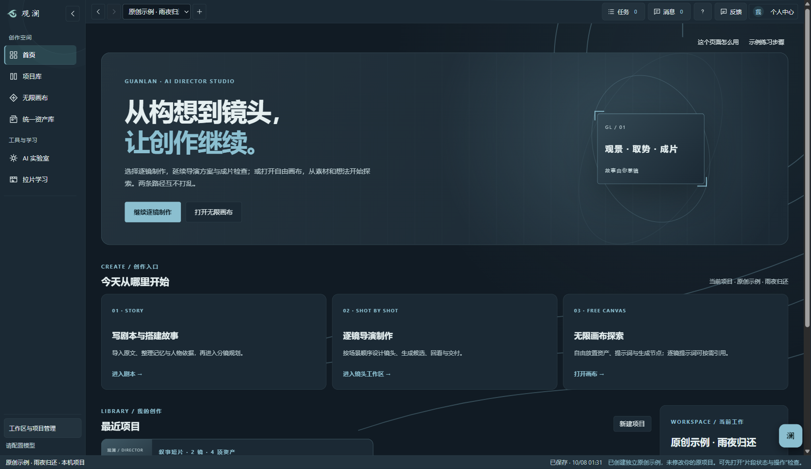
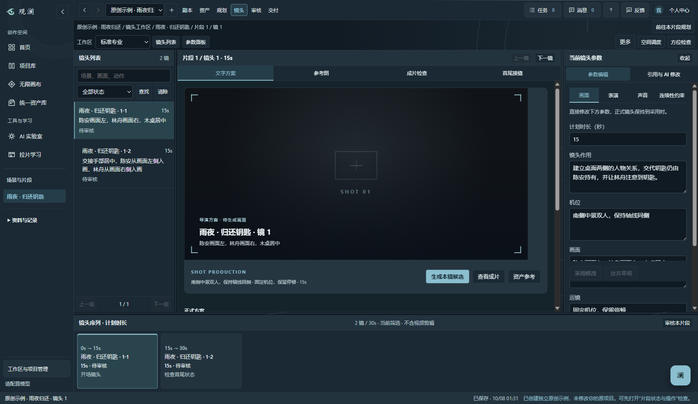
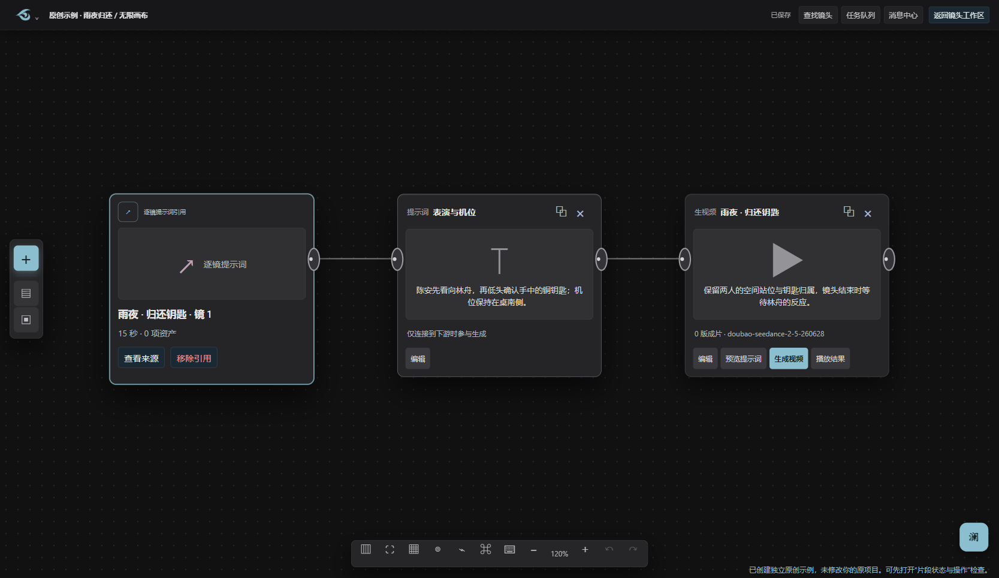
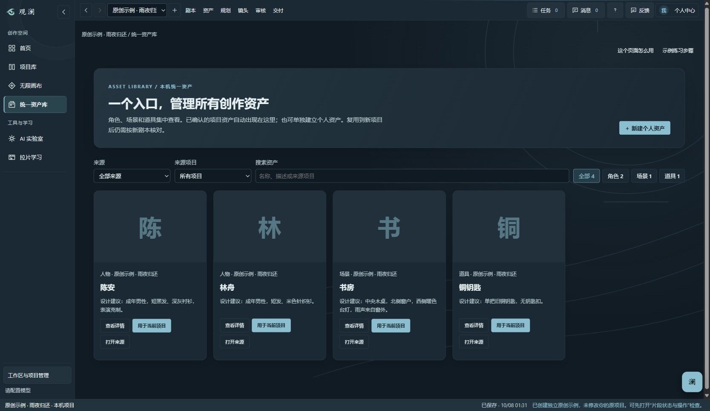

# 观澜 · AI 导演创作工作台

观澜是一款本地优先的 Windows AI 导演工作台。它把剧本、人物与场景资产、空间站位、逐镜表演、提示词和成片结果放进可核对的制作链。面向个人专业创作者，优先保证导演意图、镜头连续性和资料归属清楚。

> **能力边界**：观澜已接入火山方舟 Seedance 2.5、2.0、2.0 Fast 和 2.0 Mini。逐镜工作区支持文生视频及明确选择首帧图的图生视频、任务查询和成片检查；独立画布支持文本节点链路提交文生视频，并在画布节点播放或导出结果。两条流程均需要用户自己的 API 密钥和可用额度。其他“目标视频模型”仍只适配提示词交付，不代表已连接。剪辑仍在外部工具完成。

## 下载并打开（Windows 10/11，64 位）

1. 打开 [最新版本下载页](https://github.com/XiaoWuheng/guanlan-ai-director/releases/latest)，展开页面下方的 **Assets**，下载 `Guanlan-0.17.4-Windows-Portable.exe`。`Source code` 是源码压缩包，普通使用者无需下载。
2. 把下载的 `.exe` 放在容易找到的文件夹，例如 `D:\观澜`。在文件资源管理器中**双击这个 `.exe`** 即可打开；它是便携版，无需解压或安装。以后仍从这个文件打开。
3. 首次启动如出现 Windows 的“未知发布者”提示，是因为当前版本未签名。先核对下载来源与发布页公布的 SHA-256；一致后再点“更多信息 → 仍要运行”。哈希不一致时不要运行。
4. 进入首页后，可先点“体验原创示例”查看项目。制作自己的作品时点“新建项目”，选择“已有剧本或故事想法”“已有 SRT 字幕”或“空白画布”。没有连接模型，也能导入剧本、手动写镜头、整理资产和导出提示词。

找不到下载文件时，在浏览器下载记录中点“在文件夹中显示”。打不开时，先确认系统为 64 位 Windows 10/11、文件已下载完整，再按下方“参与与反馈”的要求提交错误信息。

## 第一次制作：从剧本到逐镜提示词

1. 在首页点“新建项目”，填写名称，选择作品品类、画幅和视觉风格。暂时不确定模型时保留默认值；“目标视频模型”先影响提示词交付格式，不会自动发起付费生成。
2. 在剧本页导入 TXT、Markdown、SRT、Word 或文字型 PDF，检查导入的文字与时间码；没有现成剧本也可直接输入故事想法。
3. 到分镜规划建立第一镜，写清镜头作用、画面中可见的动作、人物反应与机位。人物、场景和道具可在资产页建立并确认，再引用到镜头。
4. 到“逐镜制作”查看当前镜头，调整参数、检查连续性，然后导出逐镜提示词。没有连接 AI 时，这条人工制作与导出路径仍可使用。
5. 若要在观澜内生成视频，进入“镜头工作区 → 成片检查 → 配置 Seedance 连接”，填写自己的 API 密钥及可用模型 ID；回到该镜头，点“生成本镜候选”，核对提示词与费用后提交。完成后在成片检查中播放、比较并记录判断。

无限画布是另一条独立路径：从首页点“打开无限画布”，用左侧“＋”放置提示词、资产和生成卡片，连接上游与生成节点后先预览合成提示词，再决定是否提交生成。拉片学习位于单独的学习区，可导入本机视频或公开链接；AI 分析需要另行连接支持图片输入的模型。详细操作见 [十分钟上手](docs/GETTING_STARTED.md) 和 [AI 能力说明](docs/AI_CAPABILITIES.md)。

## 从这里开始

- [十分钟上手](docs/GETTING_STARTED.md)：从创建项目到生成或关联成片。
- [AI 能力与链接拉片](docs/AI_CAPABILITIES.md)：哪些操作会调用模型、视频链接的支持范围。
- [模型预设与真实连接](docs/MODEL_PRESETS.md)：区分可提交的生成型号与提示词交付预设。
- [架构与数据边界](docs/ARCHITECTURE.md)：模块、存储、技能和扩展入口。
- [视觉与动效规范](docs/VISUAL_SYSTEM.md)：潮汐、墨山、星垣三套主题。
- [片头画面来源](docs/BOOT_ART_PROVENANCE.md)：三张原创场景的生成方式与提示词。
- [更新记录](CHANGELOG.md)：当前版本及验证范围。

## 界面预览（v0.17.4）

以下画面由当前版本使用独立的原创示例项目截取，不含个人项目资料。图片可点开查看原尺寸。

首页：选择逐镜制作或独立画布，查看最近项目。



逐镜工作区：左侧镜头列表、中间监看与生成入口、右侧参数，以及底部镜头序列。



无限画布：将现有镜头提示词作为引用卡接入节点链，和逐镜流程分开使用。



统一资产库：集中查看已确认的角色、场景和道具，并在项目间复用。



## 已有能力

- 独立创作首页和项目库：按项目名、类型或剧本文字查找；可从已有剧本、SRT 字幕或空白画布新建，项目卡直接进入逐镜、画布或剧本。逐镜区以当前镜头监看、生成候选与侧边参数为主，画布则是一条独立的自由创作路径。
- 剧本导入、故事记忆、事实与资产版本管理。
- 侧栏统一资产库汇集所有项目已确认的角色、场景和道具，也可独立新建个人资产、上传参考图、按来源项目与来源类型搜索筛选；跨项目引用会建立待复核副本，不覆盖来源。
- 分镜规划、镜头作用、人物表演、空间锚点、运镜与连续性审核。
- 独立沉浸式无限画布：进入后隐藏常驻侧栏，左侧悬浮「＋」或空白处右键打开节点菜单，可加入已确认资产、文字提示词、图片、音频、视频素材、导演台和生视频节点，也能从统一资产库导入或引用现有逐镜提示词；卡片不展开原镜头全文。底部提供缩放、适配、整理、小地图、8px 吸附、连线筛选及撤回／重做；顶部显示自动保存结果、任务队列和本机消息。支持连线、平移、缩放和保存布局，仅按上游连接合成提示词。生视频节点既可绑定逐镜，也可独立生成；上游图片可选作首帧，已连接的生图模型可在图片节点生成图片，完成后直接在卡片内播放或导出 MP4。音频和视频素材节点目前用于本机预览及文字要求，不会作为多模态输入上传。
- Seedance 2.5 / 2.0 系列视频生成：按镜头选择纯文字或已确认资产首帧，提交一次任务、恢复查询、下载到本机、回填成片检查；也支持外部成片逐镜关联、批量回填和同镜版本对照。
- 独立的拉片学习区：本机视频或公开链接导入、自适应候选拆镜、逐镜视觉 AI 分析及中断续跑、待复核图文报告、带关键帧与解释的 Excel 导出。

- 观澜 AI 实验室集中脚本撰写、短片诊断、澜芯技能和文件参考，并列出已有任务结果；拉片学习仍独立于制作流程。
- 全局顶部显示实际保存时间、跨项目任务队列、消息中心、帮助和反馈；任务与消息可返回来源。保存状态只在本机持久化成功后更新。
- 澜芯助手按项目阶段建议下一步，显示多步骤任务进度；支持新建、切换、删除独立对话及受限制的本机操作，技能文件中的脚本不会被执行。
- 仅统计观澜模型调用的 Token 看板，未连接模型时显示空状态。
- 潮汐、墨山、星垣三套原创主题，带各自边缘装饰与可跳过的电影感启动片头。

## 本地运行

要求 Windows、Node.js 与 npm。安装依赖后运行：

```powershell
npm ci
npm start
```

正式便携包已内置 yt-dlp 与 FFmpeg 视频解析组件，不需要在目标电脑安装 Python 或单独配置这两个程序。源码构建使用仓库 `vendor/` 中附带且已校验的运行文件；来源、版本、许可与源码位置见 [运行组件说明](vendor/README.md)。AI 分析仍需用户在目标电脑连接可用的视觉模型服务；模型密钥不会随程序或资料库一起分发。

公开源码不包含个人导演资料 `src/builtin-knowledge.json`、`src/builtin-course.json` 和私有反馈配置 `src/private-feedback.json`。程序在缺少这些文件时正常启动；用户可在自己的资料库导入合法持有的参考资料。没有私有反馈配置时，反馈页提供复制与导出，不显示邮件按钮。本机个人版仍可使用本地文件。

```powershell
npm test
npm run test:canvas
npm run test:video
npm run test:visual
npm run test:usage
npm run test:cinematic
npm run test:results
node tests/layout-resilience.cjs
npm run dist:public
npm run release:public-check
```

`dist:public` 会排除上述个人资料。`dist:portable` 是本机个人构建，不应用作公开发布物。公开便携版目前未签名。项目资料默认保存在 Windows 用户数据目录，也可在程序的资料位置设置中迁移到自己选择的文件夹；更新便携版时保留原资料目录，换电脑时先在旧电脑迁移资料，再在新电脑连接该资料目录。不要把资料目录、真实剧本或密钥提交到 Git 仓库。

## 参与与反馈

先阅读 [贡献指南](CONTRIBUTING.md) 和 [内容来源清单](THIRD_PARTY_CONTENT.md)。报告问题请提供版本、系统、复现步骤和期望结果；不要附上真实剧本、密钥或未经授权的素材。

源码许可见 [MIT LICENSE](LICENSE)。用户自行导入的资料、第三方模型服务以及未加入公开仓库的个人导演资料不在该许可范围内。
